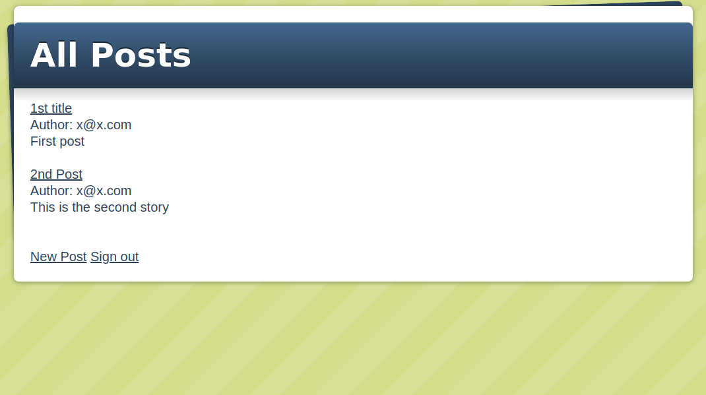

# Rails Programming

## PROJECT: Members Only!

## Introduction

In this project we built a exclusive clubhouse where members can write anonymous posts. Inside the clubhouse, members can see who the author of a post is but, outside, they can only see the story and wonder who wrote it.
[The Odin Project](https://www.theodinproject.com/courses/ruby-on-rails/lessons/authentication).

We used basic concepts of Ruby on Rails including:

- Models, Views, and Controllers (MVC)
- Data Structures & Relationships
- Routing
- Migrations
- View
- RESTful design
- Authentification system
- Adding gems for extra features

## To install and run

- Clone the project repo from [GitHub](https://github.com/krishnzzz/blogger) using `git clone https://github.com/krishnzzz/blogger`
- Make sure [Ruby-lang](https://www.ruby-lang.org/en/) is installed
- Make sure [Bundler](https://bundler.io/) is installed
- Install the required gems. Run `bundle install`
- Install the locale database. Run `rake db:migrate`
- If you have problems with the gem versions try installing [RVM](https://rvm.io/)
- Launch a Rails Server using `rails server`
- Open your browser and go to `127.0.0.1:3000` or `localhost:3000`

## Members only! app

This is the blog for a clubhouse where any member can create his own posts but you can only see the author of the posts if you are signed in.

The main page will display all the posts created.

To create a new post you will need to be signed in. If you are not signed in you will be sen to page with sign in and sign up options.
After you have siggned in you can create a new post.

You can see any post just clicking on the post.

You will have a sign out link if you are signed in and a sign in button if you are not signed in.

## Designed With
- Ruby
- Rails
- Git
- Gitflows
- Rubocop
- Styleint
- VS Code

## Contribute to this Project

Contributions, issues, and feature requests are welcome! Start by:

  - Forking the project
  - Cloning the project to your local machine
  - cd into the project directory
  - Run git checkout -b your-branch-name
  - Make your contributions
  - Push your branch up to your forked repository
  - Open a Pull Request with a detailed description of the development branch of the original project for a review

## Authors

👤 **Angel Barros**

- GitHub: [@Zappat0n](https://github.com/Zappat0n)
- LinkedIn: [LinkedIn](https://www.linkedin.com/in/angel-barros/)

👤 **Nick Kuria**
- Github: 
- LinkedIn: 

## Show your support

Give a ⭐️ if you like this project!
